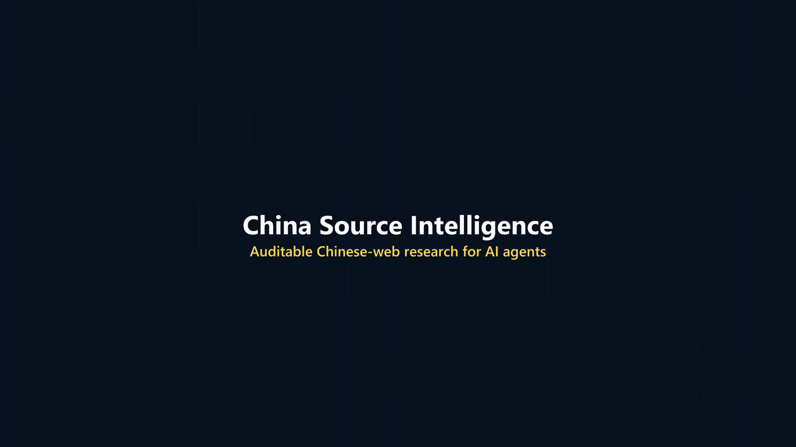

# China Source Intelligence — Worked Demo

This repository demonstrates the paid skill on a real Chinese trade-policy question:

> Did China ban rare-earth exports in 2025, or did it impose a licensing regime on specified items?



[Watch the 30-second product demo](assets/china-source-intelligence-demo.mp4)

The deliverables are deliberately separated:

- `china-rare-earth-export-controls-2025.md` — concise bilingual research report.
- `evidence.jsonl` — claim-level evidence ledger accepted by the included auditor.

Reproduce the workflow from the project root:

```powershell
python work\agensi\china-source-intelligence\scripts\build_query_matrix.py "稀土出口管制" --alias "China rare earth export controls" --start-year 2025 --format json
python work\agensi\china-source-intelligence\scripts\audit_evidence.py work\agensi\demo\evidence.jsonl
```

The first command emits 216 source-targeted searches. The second completes with zero errors and zero warnings.

This public demo contains no credentials, private data, or paid package source code.
